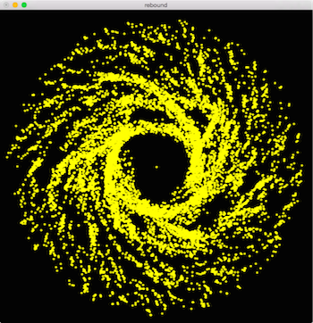
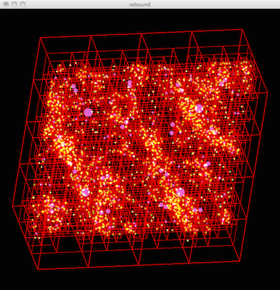

Welcome to REBOUND!
===================
.. image:: images/dense.png
   :width: 362px
   :height: 350px
   :align: right

.. image:: images/outersolarsystem.png
   :width: 362px
   :height: 350px
   :align: right

REBOUND is an N-body integrator, i.e. a software package that can integrate the motion of particles under the influence of gravity. The particles can represent stars, planets, moons, ring or dust particles. REBOUND is very flexible and can be customized to accurately and efficiently solve many problems in astrophysics.  An incomplete feature list of REBOUND:

* Symplectic integrators (WHFast, WHFastHelio, SEI, LEAPFROG)
* High accuracy non-symplectic integrator with adaptive timestepping (IAS15)
* Support for collisional/granular dynamics, various collision detection routines
* The code is written entirely in C, conforms to the ISO standard C99 and can be used as a thread-safe shared library
* Easy-to-use Python module, installation in 3 words: `pip install rebound`
* Extensive set of example problems in both C and Python
* Real-time, 3D OpenGL visualization (C version)
* Parallelized with OpenMP (for shared memory systems)
* Parallelized with MPI using an essential tree for gravity and collisions (for distributed memory systems)
* No libraries are needed, use of OpenGL/glfw3 for visualization is optional
* The code is fully open-source and can be downloaded freely from http://github.com/hannorein/rebound
* No configuration is needed to run any of the example problems. Just type `make && ./rebound` in the problem directory to run them
* Comes with standard ASCII or binary output routines 
* Different modules are easily interchangeable at runtime

How to use REBOUND - a quick introduction
-----------------------------------------
You can call REBOUND from C or Python. Which programming language you want to use depends on your taste and your specific application. In short: If you simply want to setup a few particles such as a planetary system, visualize it with a WebGL widget, and integrate it with the high order integrator IAS15 or the new symplectic integrator WHFast then use the Python version. If you want to run large simulations with millions of particles, use an exotic integrator, use fast OpenGL visualizations, or make use of the distributed tree code then use the C version. 

All the computationally expensive parts of REBOUND are written in C. So even if you use the Python version, you'll end up with a very fast code.

To install the *Python version*, simply type the following command into a terminal::

    pip install rebound

To learn more about how to use REBOUND with Python have a look at the iPython/Jupyter tutorials at https://github.com/hannorein/rebound/blob/master/ipython_examples/

To install the *C version*, clone this repository, e.g. by simply copy-and-pasting the following command into your terminal::
    
    git clone http://github.com/hannorein/rebound && cd rebound/examples/shearing_sheet && make && ./rebound

To learn more about how to use REBOUND with C, study the examples in the `examples/` directory and continue reading this file. You might also want to have a look at the `rebound.h` file in the `src/` directory which contains the API specifications. Last but not least, REBOUND is open source. If you want to know how something works, you can just look at the source code. And of course, you are welcome to e-mail any of the contributors with questions. We'll do our best to answer them quickly.

Note:  If you want to run REBOUND on Windows, the best way is likely to install the Windows Subsystem for Linux. After installing the gcc compiler, e.g., sudo apt-get install gcc, you should be able to install REBOUND and any python libraries by following the Linux/Mac installation instructions in this documentation. Unfortunately we do not have Windows installations ourselves, so we cannot actively support installation problems. Thanks to Keto /Zhang for finding this workaround.

Contributors
------------
* Hanno Rein, University of Toronto, <hanno@hanno-rein.de>
* Shangfei Liu, Kavli Institute for Astronomy and Astrophysics at Peking University (KIAA-PKU), Beijing, <liushangfei@pku.edu.cn>
* David S. Spiegel, Institute for Advanced Study (IAS), Princeton, <dave@ias.edu>
* Akihiko Fujii, National Astronomical Observatory of Japan/University of Tokyo, Tokyo, <akihiko.fujii@nao.ac.jp>
* Dan Tamayo, University of Toronto, <dtamayo@cita.utoronto.ca>
* Ari Silburt, Penn State University <ajs725@psu.edu>
* and many others!

REBOUND is open source. You are invited to contribute to this project if you are using it. Please contact any of the authors above if you have any questions.

Papers
------
There are five papers describing the functionality of REBOUND. 

1. Rein & Liu 2012 (Astronomy and Astrophysics, Volume 537, A128) describe the code structure and the main feature including the gravity and collision routines for many particle systems. http://adsabs.harvard.edu/abs/2012A%26A...537A.128R 

2. Rein & Spiegel 2015 (Monthly Notices of the Royal Astronomical Society, Volume 446, Issue 2, p.1424-1437) describe the versatile high order integrator IAS15 which is now part of REBOUND. http://adsabs.harvard.edu/abs/2015MNRAS.446.1424R

3. Rein & Tamayo 2015 (Monthly Notices of the Royal Astronomical Society, Volume 452, Issue 1, p.376-388) describe WHFast, the fast and unbiased implementation of a symplectic Wisdom-Holman integrator for long term gravitational simulations. http://adsabs.harvard.edu/abs/2015MNRAS.452..376R

4. Rein & Tamayo 2016 (Monthly Notices of the Royal Astronomical Society, Volume 459, Issue 3, p.2275-2285) develop the framework for second order variational equations. http://arxiv.org/abs/1603.03424

5. Rein & Tamayo 2017 (submitted to Monthly Notices of the Royal Astronomical Society) describes the Simulation Archive for exact reproducibility of N-body simulations. http://rein.utsc.utoronto.ca/sa_preprint.pdf

Acknowledgments
---------------
When you use this code or parts of this code for results presented in a scientific publication, please send us a copy of your paper so that we can keep track of all publications that made use of the code. We would greatly appreciate a citation to Rein and Liu (2012) and an acknowledgment of the form:

"Simulations in this paper made use of the REBOUND code which can be downloaded freely at http://github.com/hannorein/rebound."

If you use the IAS15 integrator, please cite Rein and Spiegel (2015).

If you use the WHFast integrator, please cite Rein and Tamayo (2015).

If you use the variational equations, please cite Rein and Tamayo (2016).

License
-------
REBOUND is free software: you can redistribute it and/or modify it under the terms of the GNU General Public License as published by the Free Software Foundation, either version 3 of the License, or (at your option) any later version.

REBOUND is distributed in the hope that it will be useful, but WITHOUT ANY WARRANTY; without even the implied warranty of MERCHANTABILITY or FITNESS FOR A PARTICULAR PURPOSE.  See the GNU General Public License for more details.

You should have received a copy of the GNU General Public License along with REBOUND.  If not, see <http://www.gnu.org/licenses/>.

Table of Contents
-----------------
.. toctree::
   :maxdepth: 2

   
   self
   changelog
   modules
   quickstart
   examples
   c_api
   python_api

