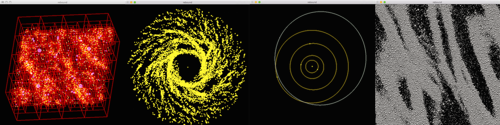

# Welcome to REBOUND



REBOUND is an N-body integrator, i.e. a software package that can integrate the motion of particles under the influence of gravity. The particles can represent stars, planets, moons, ring or dust particles. REBOUND is very flexible and can be customized to accurately and efficiently solve many problems in astrophysics.  

## Features

* Symplectic integrators (WHFast, SEI, LEAPFROG, EOS)
* High order symplectic integrators for integrating planetary systems (SABA, WH Kernel methods)
* Hybrid symplectic integrators for planetary dynamics with close encounters (MERCURIUS)
* High accuracy non-symplectic integrator with adaptive time-stepping (IAS15)
* Support for collisional/granular dynamics, various collision detection routines
* The code is written entirely in C, conforms to the ISO standard C99 and can be used as a thread-safe shared library
* Easy-to-use Python module, installation in 3 words: `pip install rebound`
* Extensive set of example problems in both C and Python
* Real-time, 3D OpenGL visualization (C version)
* Parallelized with OpenMP (for shared memory systems)
* Parallelized with MPI is supported for some special use cases only (using an essential tree for gravity and collisions)
* No dependencies on external libraries (use of OpenGL/glfw3 for visualization is optional)
* The code is 100% open-source. All features are inluced in the public repository on [github](https://github.com/hannorein/rebound)
* No configuration is needed to run any of the example problems. Just type `make && ./rebound` in the problem directory to run them
* Comes with standard ASCII or binary output routines
* Different modules are easily interchangeable at runtime

## Contributors

* Hanno Rein, University of Toronto, <hanno@hanno-rein.de>
* Dan Tamayo, Princeton University, <dtamayo@astro.princeton.edu>
* David S. Spiegel, Institute for Advanced Study Princeton, <dave@ias.edu>
* Garett Brown, University of Toronto, <gbrown@physics.utoronto.ca>
* Shangfei Liu, Kavli Institute for Astronomy and Astrophysics at Peking University, <liushangfei@pku.edu.cn>
* Ari Silburt, Penn State University, <ajs725@psu.edu>
* and many others! Check the git history to find out who contributed to the code.

REBOUND is open source and you are invited to contribute to this project! 


## Papers

There are several papers describing the functionality of REBOUND.

1. Rein & Liu 2012 (Astronomy and Astrophysics, Volume 537, A128) describes the code structure and the main feature including the gravity and collision routines for many particle systems. <http://adsabs.harvard.edu/abs/2012A%26A...537A.128R>

2. Rein & Tremaine 2011 (Monthly Notices of the Royal Astronomical Society, Volume 415, Issue 4, pp. 3168-3176) describes the Symplectic Epicycle integrator for shearing sheet simulations. <https://ui.adsabs.harvard.edu/abs/2011MNRAS.415.3168R>

3. Rein & Spiegel 2015 (Monthly Notices of the Royal Astronomical Society, Volume 446, Issue 2, p.1424-1437) describes the versatile high order integrator IAS15 which is now part of REBOUND. <http://adsabs.harvard.edu/abs/2015MNRAS.446.1424R>

4. Rein & Tamayo 2015 (Monthly Notices of the Royal Astronomical Society, Volume 452, Issue 1, p.376-388) describes WHFast, the fast and unbiased implementation of a symplectic Wisdom-Holman integrator for long term gravitational simulations. <http://adsabs.harvard.edu/abs/2015MNRAS.452..376R>

5. Rein & Tamayo 2016 (Monthly Notices of the Royal Astronomical Society, Volume 459, Issue 3, p.2275-2285) develop the framework for second order variational equations. <https://ui.adsabs.harvard.edu/abs/2016MNRAS.459.2275R>

6. Rein & Tamayo 2017 (Monthly Notices of the Royal Astronomical Society, Volume 467, Issue 2, p.2377-2383) describes the Simulation Archive for exact reproducibility of N-body simulations. <https://ui.adsabs.harvard.edu/abs/2017MNRAS.467.2377R>

7. Rein & Tamayo 2018 (Monthly Notices of the Royal Astronomical Society, Volume 473, Issue 3, p.3351–3357) describes the integer based JANUS integrator. <https://ui.adsabs.harvard.edu/abs/2018MNRAS.473.3351R>

8. Rein, Hernandez, Tamayo, Brown, Eckels, Holmes, Lau, Leblanc & Silburt 2019 (Monthly Notices of the Royal Astronomical Society, Volume 485, Issue 4, p.5490-5497) describes the hybrid symplectic integrator MERCURIUS. <https://ui.adsabs.harvard.edu/abs/2019MNRAS.485.5490R>

9. Rein, Tamayo & Brown 2019 (Monthly Notices of the Royal Astronomical Society, Volume 489, Issue 4, November 2019, Pages 4632-4640) describes the implementation of the high order symplectic integrators SABA, SABAC, SABACL, WHCKL, WHCKM, and WHCKC. <https://ui.adsabs.harvard.edu/abs/>

## Acknowledgments

If you use this code or parts of this code for results presented in a scientific publication, we would greatly appreciate a citation.
please cite REBOUND.
The simplest way to find the citations relevant to the specific setup of your REBOUND simulation is: 

```python
sim = rebound.Simulation()
-your setup-
sim.cite()
```

!!! Info
    When you cite one of the REBOUND papers, your paper will receive an automatic shout-out from the [REBOUND Citation Bot](https://twitter.com/reboundbot). 

## License

REBOUND is free software: you can redistribute it and/or modify it under the terms of the GNU General Public License as published by the Free Software Foundation, either version 3 of the License, or (at your option) any later version.

REBOUND is distributed in the hope that it will be useful, but WITHOUT ANY WARRANTY; without even the implied warranty of MERCHANTABILITY or FITNESS FOR A PARTICULAR PURPOSE.  See the GNU General Public License for more details.

You should have received a copy of the GNU General Public License along with REBOUND.  If not, see <http://www.gnu.org/licenses/>.

